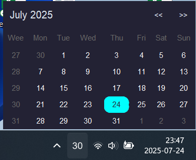

# WeekTrayMA - A System Tray Calendar for Windows

WeekTrayMA is a lightweight, standalone calendar application for Windows that lives in your system tray. It's designed to give you a quick view of the current month's calendar, with a special focus on showing the week number.




## Features

* **System Tray Integration:** See the current week number conveniently displayed in your system tray.
* **Integrated Calendar:** Access a full calendar view that clearly shows week numbers for every month.
* **Automatic Theme Adaptation:** Automatically detects Windows theme to adapt the font color.

## Requirements

*   Windows OS
*   Python 3.x

## Usage

1.  **Install the dependencies:**
    ```sh
    pip install -r requirements.txt
    ```
    
2.  **Create a virtual environment (recommended):**
Run the main application file from the `src` directory:
    ```sh
    python src/main.py
    ```

The application icon showing the current week number will appear in your system tray. Click the icon to open the calendar window.